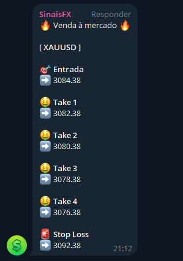
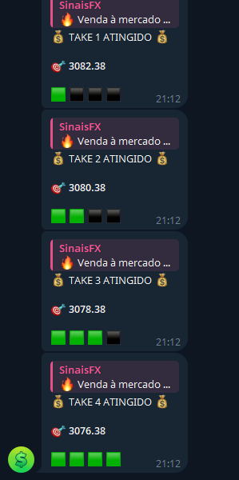

**Requisitos**

* Bot no Telegram
* ID do canal / grupo
* MetaTrader 5

**Configuração**

*Telegram*

> Adicione o bot como administrador em seu canal / grupo

*MetaEditor*

1. Coloque os arquivos `Custom AVG.mq5` e `logo.ico` dentro da pasta Indicators
2. Coloque os arquivos `JAson.mqh` e `Wininet.mqh` dentro da pasta Include
3. Abra o arquivo Custom AVG.mq5, adicione o **Token** do bot e o **ID** do canal / grupo ( linha 35 e 36 )
4. Clique em Compilar

*MetaTrader*

1. Pressione CTRL + O e clique em *Expert Advisors*
2. Permita o uso de DLL externo
3. Adicione a url `https://api.telegram.org` e clique em OK
4. Acesse o menu *Inserir > Indicadores > Personalizar* e procure pelo Custom AVG
5. Clique em *Dependências*, permita o uso de DLL externo e clique em OK

